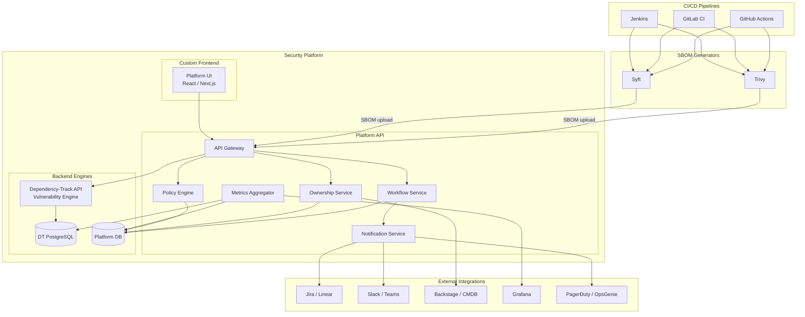
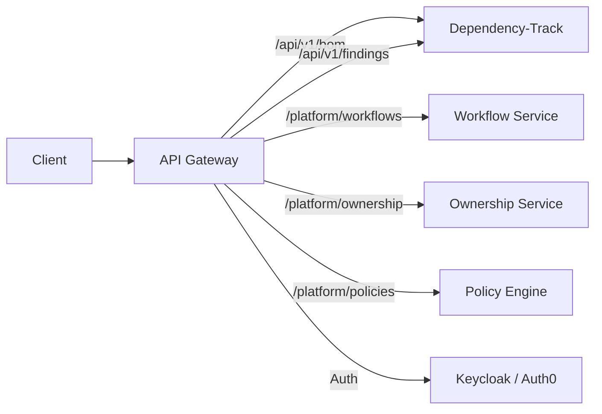
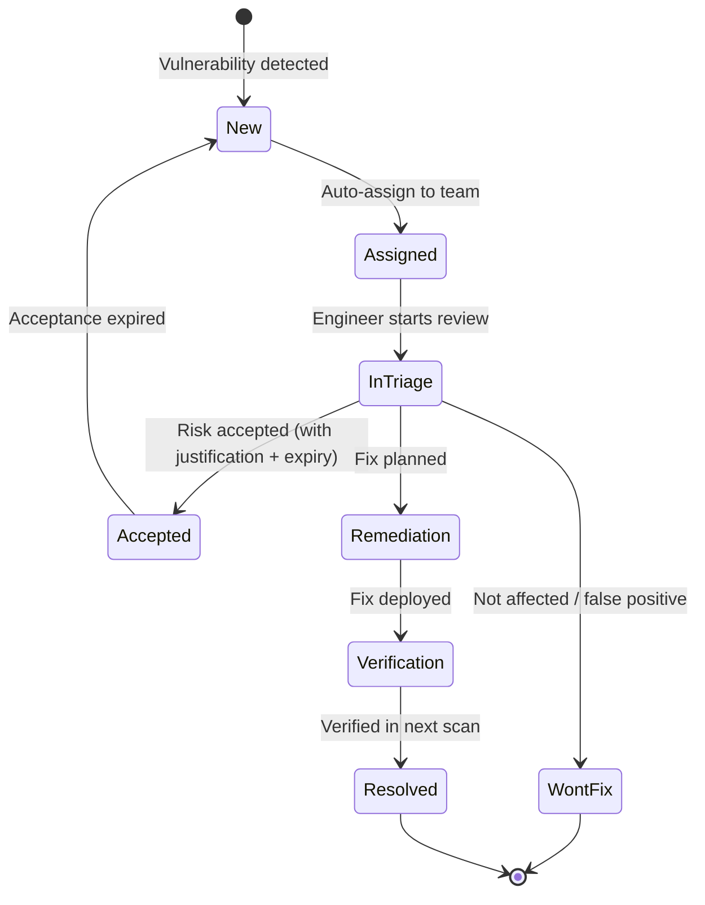
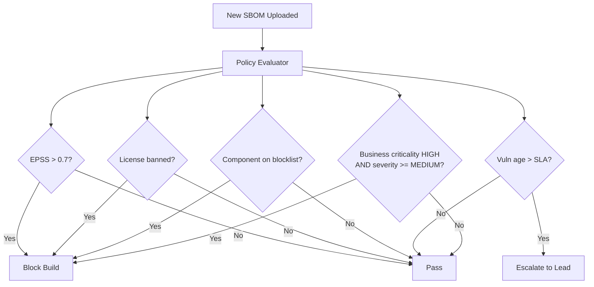
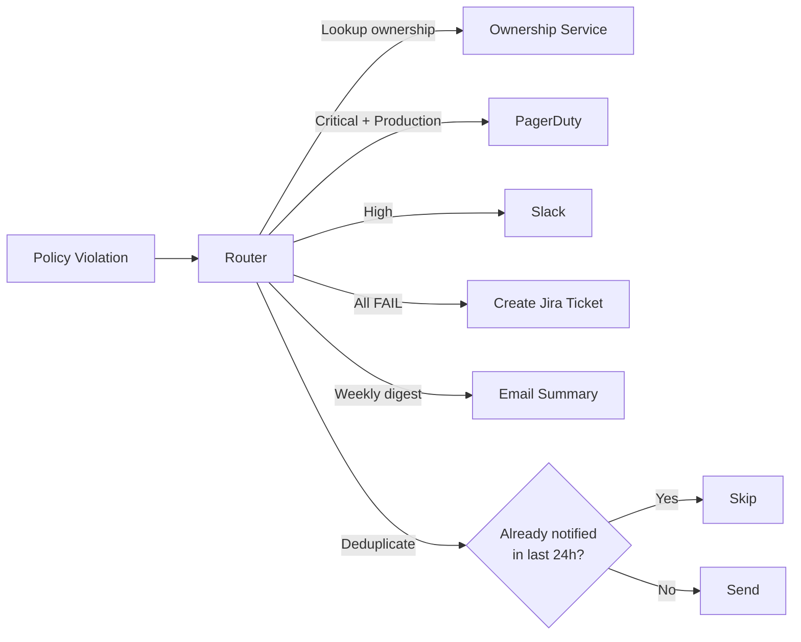
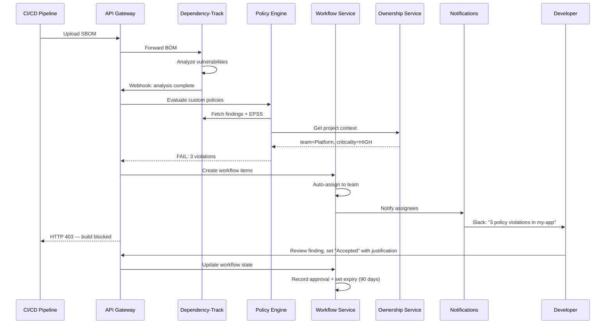

# Security Platform Architecture (Proposal)

> **Note:** This is an architectural proposal — a high-level vision of what a custom security platform built on top of Dependency-Track could look like. None of this is implemented yet. The goal is to outline what's possible and provide a migration path from the current setup to a full-featured platform.

## Concept

Use Dependency-Track as a **headless vulnerability engine** — keep its powerful BOM processing, vulnerability correlation, and NVD/GitHub Advisory mirroring, but replace the frontend and extend the backend with custom services that add missing capabilities.



## Component Breakdown

### API Gateway

Single entry point for all platform consumers (UI, CI/CD, integrations).



Responsibilities:
- Unified authentication (OIDC/JWT) across all services
- Rate limiting and audit logging
- Route requests to DT or platform services
- Enrich DT responses with platform data (ownership, workflow state)

### Workflow Service

What DT lacks most — **human workflows around findings**.



Features:
- **Assignment** — assign findings to specific people, not just teams
- **SLA tracking** — per-severity deadlines with escalation
- **Risk acceptance** — time-limited acceptance with justification and approver
- **Audit trail** — who changed what, when, why
- **Bulk operations** — triage 50 similar findings at once
- **Auto-triage rules** — "if component is in dev-only scope AND severity < HIGH, auto-accept for 90 days"

### Ownership Service

Maps projects to teams, people, and external systems.

```yaml
# What the ownership service stores
project: my-app
version: "2.0.0"
team: Platform
team_lead: alice@company.com
jira_project: PLAT
slack_channel: "#platform-security"
pagerduty_service: P12345
backstage_entity: component:default/my-app
sla_override:
  critical: 3d    # stricter than default 7d
business_criticality: HIGH
environment: production
```

Data sources (priority order):
1. Backstage / service catalog (auto-sync)
2. Platform DB (manual overrides)
3. DT tags (fallback)

### Custom Policy Engine

Go beyond DT's built-in policy conditions.



Rules that DT can't express natively:
- **EPSS-based gating** — block only if exploit probability is high
- **Context-aware** — different rules for production vs dev environments
- **Compound conditions** — severity + EPSS + business criticality combined
- **Time-based** — "new critical vulns block immediately, but allow 24h grace period for existing ones"
- **Exception management** — approved exceptions with expiry dates and audit trail
- **Dependency scope** — block production deps but warn on dev/test deps

### Notification Service

Smart alerting with deduplication and routing.



Features:
- **Smart routing** — severity + environment + business criticality → notification channel
- **Deduplication** — don't spam the same team about the same vuln
- **Escalation** — if SLA breach: notify engineer → team lead → engineering manager
- **Digest mode** — weekly summary email instead of per-finding alerts
- **Actionable notifications** — Slack messages with "Accept Risk" / "Create Ticket" buttons

### Metrics Aggregator

Unified metrics from DT + platform data for Grafana.

- Pull vulnerability data from DT's PostgreSQL
- Enrich with ownership, workflow state, SLA compliance from platform DB
- Expose as Prometheus metrics or materialized views
- Power executive dashboards: "mean time to remediate by team", "SLA compliance trend"

## What the Custom UI Adds Over DT's Frontend

| Feature | DT Frontend | Custom Platform UI |
|---|---|---|
| View vulnerabilities | Yes | Yes + enriched with ownership, SLA |
| Assign to person | No | Yes — pick from team roster |
| Bulk triage | Limited | Yes — filter + select + bulk action |
| Risk acceptance | Comment only | Formal flow with approver, expiry, justification |
| Team dashboard | No | Yes — each team sees only their projects |
| SLA countdown | No | Yes — "3 days left to fix" per finding |
| Exception requests | No | Yes — request → approve → track → expire |
| Cross-tool view | DT only | DT + Jira ticket + CI status + deploy state |
| Executive view | No | Yes — org-wide risk posture, trends, compliance |
| EPSS prioritization | Basic | Advanced — combined with business context |
| Audit log | Limited | Full — who did what, when, why |
| SSO / RBAC | Basic OIDC | Full RBAC — team-scoped views and permissions |

## Data Flow: End-to-End



## Tech Stack Suggestion

| Component | Technology | Why |
|---|---|---|
| API Gateway | Kong / Traefik / custom Go | Routing, auth, rate limiting |
| Platform API | Go / Node.js (NestJS) | Fast, type-safe, good API tooling |
| Platform DB | PostgreSQL | Same stack as DT, can join if needed |
| Custom UI | React + Next.js | Modern, component ecosystem |
| Auth | Keycloak | OIDC, RBAC, team management |
| Notifications | Custom service + Slack API | Flexible routing logic |
| Metrics | Grafana + existing dashboards | Already built, extend with platform data |
| Message queue | Redis / RabbitMQ | Async processing between services |

## Migration Path

You don't have to build everything at once. Incremental approach:

### Phase 1: Ownership + CI Gate (weeks)
- Create `ownership.yaml` in repo
- Wire `check-policy-violations.sh` to look up ownership and notify via Slack
- Keep using DT UI for everything else
- **Value:** teams know about their vulnerabilities

### Phase 2: Custom Policy Engine (1-2 months)
- Build a service that evaluates EPSS-based and context-aware rules
- Replace `check-policy-violations.sh` with API call to policy service
- Add exception/acceptance workflow with expiry
- **Value:** smarter build gating, fewer false blocks

### Phase 3: Workflow Service + Basic UI (2-3 months)
- Build assignment, SLA tracking, bulk triage
- Simple UI showing "my team's findings" with actions
- Jira integration for automatic ticket creation
- **Value:** accountability, SLA compliance tracking

### Phase 4: Full Platform UI (3-6 months)
- Replace DT frontend entirely
- Executive dashboards, cross-tool views
- Full RBAC, team-scoped access
- Audit logging for compliance
- **Value:** single pane of glass for security posture

## Key DT APIs to Build On

```
GET  /api/v1/project                     # List all projects
GET  /api/v1/finding/project/{uuid}      # All findings for a project
GET  /api/v1/vulnerability/{source}/{id} # Vulnerability details
PUT  /api/v1/bom                         # Upload SBOM
GET  /api/v1/violation/project/{uuid}    # Policy violations
POST /api/v1/analysis                    # Set analysis state (triage)
GET  /api/v1/metrics/project/{uuid}/current  # Current risk metrics
POST /api/v1/project/{uuid}/notification/publisher  # Webhook configuration
```

DT also supports **webhooks** — configure notifications for:
- `NEW_VULNERABILITY` — new vuln found in a project
- `BOM_CONSUMED` / `BOM_PROCESSED` — SBOM upload lifecycle
- `POLICY_VIOLATION` — policy triggered

These webhooks are the primary integration point for the platform to react to DT events in real-time.
